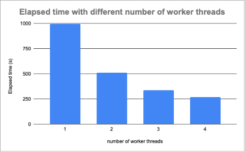

# Specification
## Objectives
- Multi-threaded Program
    - Take advantage of multi-core systems
    - Load sharing
- Linux Kernel Module
    - Understand how to write a kernel module
    - Understand how to provide read/write operations of proc files to users


## Overall Flow
1. The kernel module creates a proc entry/file with pathname `/proc/thread_info`
2. The multithreaded program does the matrix multiplication
3. Each thread writes its **thread ID** to the proc entry
4. The kernel module gets and records the **runtime** and **context switch times** of the thread
5. The multithreaded program reads the proc entry to get the runtime and context switch information
6. The multithreaded program displays the information on the console


## Requirement – Kernel Module
1. You have to write a kernel module named `My_proc`
2. The kernel module has to create a *proc* file with pathname `/proc/thread_info` during its initialization/loading
3. You have to implement ***file operations*** of the proc file
    - User threads will write their thread ids to the proc file. When a user thread writes its id, the kernel module should record the thread id, get the thread execution time and context switch count of the thread.
    - Thread execution time can be obtained from `utime`
        - context switch count = `nvcsw` + `nivcsw`
        - `utime`, `nvcsw` and `nivcsw` are fields of a task structure
    - When the proc file is read, the thread relationships and the above timing information of all the recorded threads should be output to the reader.


## Requirement - Multi-threaded Program
1. You need to write a multithreaded program to perform matrix multiplication.
2. The program starts with a single *main/parent* thread, which is responsible for creating multiple worker threads.
3. Each worker thread should perform a part of the matrix multiplication job.
4. Each worker thread should write its thread ID to the proc file ***right before*** its termination. (May cause race condition)
5. After completing the matrix multiplication, the *main thread* has to **read** the proc file and print the following resulting information on the console.
    1. Main/parent thread ID
    2. Each worker/child thread ID and execution time and context switch times.
6. After completing the matrix multiplication, the program also has to save the result of the matrix multiplication (i.e., the result matrix) to a file named as `result.txt`.
7. You should hand in a report. In the report,
- You have to explain how you dispatch works to the worker threads.
    - For example : by row dispatch or by element dispatch
- You are given four test cases. For each test case, you have to plot the matrix multiplication execution time with the following worker thread numbers.
    - Worker thread number: **1,2,3,4,8,16,24,32**
- You have to summarize the four charts you plot.
    - For example :
        1. What happen if the number of threads is less than the number of cores. Why?
        2. What happen if the number of threads is greater than the number of cores. Why?
        3. Anything else you observe
8. The executable and parameters of your multithread program:
```bash
./MT_matrix [number of worker threads] [file name of input matrix1] [file name of input matrix2]
```
9. The VM memory should be set to **4 GB**, and the VM cores should be set to **4 cores**.
    - If you can’t set your VM memory and cores as requested, you should set them as large as possible.

## Race condition
- A race condition is an undesirable situation that occurs when two or more threads can access shared resources and they try to change it at the same time.
- Assume that two threads each increment the value of a global integer variable named `count` by 1.
- In ideal case , we hope the value of `count` variable is 2.
- Each thread has its own registers.
- Split increment the value by 1 into three steps.


## Critical section
- Parts of the multithreaded program where the shared resource is accessed by more than one thread need to be protected.
- This protected section cannot be entered by more than one thread at a time.
- You can use ==`pthread_mutex_lock(pthread_mutex_t *mutex)`== and
==`pthread_mutex_unlock(pthread_mutex_t *mutex)`== to protect critical section.
- In the requirement of multi-threaded program, the fourth requirement mentioned that each worker thread should write its thread ID to the proc file ***right before*** its termination.
- The fourth requirement may cause race condition because more than one worker thread write to the proc file at the same time.
- You can use mutex lock to guard write operation to ensure kernel module can correctly record the required information.

## Input/Output Matrix Format
- You are given four test cases. Each test case contains two input matrix files.
- In a matrix file, the first line indicates the row and column of the matrix.

Example of input matrix file:
```
3 4
593 329 377 596
13 47 266 276
997 415 783 971
```

- $1 \le \text{element value} \le 1000$
- The output matrix format is the same as input matrix format.

## An Example Display Format of the Output
- Output format : 
```
PID:[PID number]
    [\t]ThreadID:[TID number] Time:[utime](ms) context switch times:[Context switches]
```
- Context switches = `nvcsw` + `nivcsw`.
- The resolution of time is millisecond.


## An Example Format of Charts in the Report
- Chart format:
    - Chart title : Elapsed time with different number of worker threads
    - X-axis title : number of worker threads
    - Y-axis title : Elapsed time (s)


- The resolution of elapsed time is second.




## Precautions
- The executable file name should be: `MT_matrix`.
- The kernel module name should be: `My_proc`.


## Reference
- [Matrix Multiplication](https://en.wikipedia.org/wiki/Matrix_multiplication)

- [pthreads(7) — Linux manual page](https://man7.org/linux/man-pages/man7/pthreads.7.html)

- [struct task_struct](https://elixir.bootlin.com/linux/v5.15.42/source/include/linux/sched.h)

`struct task_struct` defines `utime`, `nvcsw` and `nivcsw`:
```c
/*
* Define 'struct task_struct' and provide the main scheduler
* APIs (schedule(), wakeup variants, etc.)
*/

/* Context switch counts: */
unsigned long			nvcsw;
unsigned long			nivcsw;
```